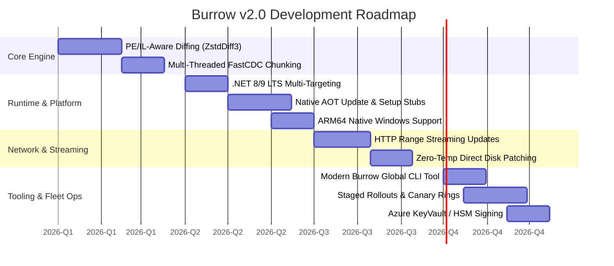

# Burrow v2.0 Roadmap

**Burrow** is the high-performance binary delta update engine and installation framework for Windows desktop applications, designed to replace legacy Squirrel with blazing-fast release generation, compact micro-deltas, bounded memory usage, and modern .NET runtime compatibility.

---

## 🎯 Vision & Core Principles

1. **Micro-Size Deltas**: Achieve $\le 5\%$ payload deltas on massive binaries through PE/IL-aware relocation normalization and high-entropy subtractive difference encoding.
2. **Sub-Second Patching**: Guarantee instant, non-blocking client updates with bounded memory ($\le 120\text{ MB}$) and high-throughput Zstandard decompression.
3. **Modern Runtime First**: First-class Native AOT, .NET 8/9 LTS, and multi-architecture execution (x64, ARM64, x86).
4. **Resilient Streaming**: Streamed HTTP Range updates with block-level cryptographic verification and atomic rollbacks.

---

## 🗺️ Release Timeline & Milestones

---

## 📋 Detailed Strategic Pillars

### 1. Advanced Delta Compression (`ZstdDiff3` & PE-Aware Diffing)
- [ ] **PE/COFF & .NET IL Relocation Normalization**:
  - Pre-filter binaries to normalize relocated memory addresses, metadata token IDs, and jump targets into canonical form before computing difference streams.
  - Target: **Shrink delta sizes from 11.2 MB down to $\le 5.0\text{ MB}$** on 200 MB releases without losing generation speed.
- [ ] **FastCDC (Content-Defined Chunking)**:
  - Add content-defined chunking for ultra-large assets ($> 1\text{ GB}$) and media resources to eliminate boundary shifting across file insertions.
- [ ] **Parallel Compression & Linear SIMD Math**:
  - Vectorize diff byte addition/subtraction loops via AVX-512 / AVX2 SIMD intrinsics.

---

### 2. Modern Runtime & Architecture Support
- [ ] **.NET 8 / .NET 9 LTS Multi-Targeting**:
  - Add `net8.0`, `net9.0`, and `net8.0-windows` targets to the Burrow core library alongside `net48` and `netstandard2.0`.
- [ ] **Native AOT Stubs (`Update.exe` & `Setup.exe`)**:
  - Rewrite bootstrapping helpers as single-file, zero-dependency Native AOT executables.
  - Cold startup time reduced to $< 30\text{ ms}$ with zero runtime prerequisites.
- [ ] **ARM64 Native Execution**:
  - Native ARM64 binaries for modern Windows on Snapdragon and Surface Pro devices.

---

### 3. Network Streaming & Zero-Temp In-Place Patching
- [ ] **HTTP Range-Request Streaming Updates**:
  - Download only the necessary delta blocks on-demand over HTTP/HTTPS rather than requiring whole `.nupkg` archive downloads.
- [ ] **Direct-to-Disk Zero-Copy Patching**:
  - Apply patches directly from memory stream into destination files without extracting intermediate `.nupkg` archives onto disk.
- [ ] **Resumable Downloads & Checkpoint Hashing**:
  - Chunk-level Merkle tree hashing to resume broken downloads mid-stream without restarting from scratch.

---

### 4. Developer Experience & CLI Tooling
- [ ] **Modern `burrow` CLI (`dotnet tool install -g burrow.cli`)**:
  - `burrow pack` — Package applications into Burrow-ready releases.
  - `burrow releasify` — Generate full and delta packages with automatic signing.
  - `burrow verify` — Perform bit-exact SHA-256 and cryptographic signature validation.
  - `burrow bench` — Automated delta size and patch speed diagnostic report generator.
- [ ] **CI/CD Integration**:
  - Official GitHub Actions (`burrow-actions/releasify`) and Azure DevOps Pipeline tasks.
- [ ] **Cloud Code Signing**:
  - Native integration with Azure Key Vault, AWS CloudHSM, and DigiCert ONE for automated EV certificate signing.

---

### 5. Enterprise Fleet Management & Telemetry
- [ ] **Staged Rollouts & Deployment Rings**:
  - Client-side and server-side ring support: `Internal`, `Canary`, `Beta`, and `Production`.
- [ ] **Crash Detection & Auto-Rollback**:
  - Heartbeat monitor during post-update startup; automatically reverts to the previous version (`app-old`) if the new release crashes on launch.
- [ ] **Differential Telemetry & Analytics**:
  - Optional opt-in telemetry hooks for update success rates, network download speeds, and patching durations.

---

## 📊 Version 2.0 Target Benchmarks

| Metric | Squirrel (BSDiff) | Burrow v1.0 (`ZstdDiff2`) | Burrow v2.0 Goal |
| :--- | :--- | :--- | :--- |
| **Delta Package Size (200MB App)** | `5.53 MB` | `11.25 MB` | **`< 5.00 MB`** |
| **Delta Creation Time** | `~975 s` *(16.25 min)* | `70.68 s` | **`< 45.00 s`** |
| **Client Patch Application** | `84.38 s` | `60.80 s` | **`< 25.00 s`** |
| **Peak Memory Footprint** | `~4.0 GB` | `< 250 MB` | **`< 120 MB`** |
| **Runtime Requirements** | .NET 4.5+ | .NET 4.8 / netstandard2.0 | **Native AOT / .NET 8 / 9** |
| **Platform Support** | x86 only | x86 / x64 | **x86 / x64 / ARM64** |
| **Bit-Exact SHA-256** | ❌ | ✅ 100% Match | **✅ 100% Match** |
